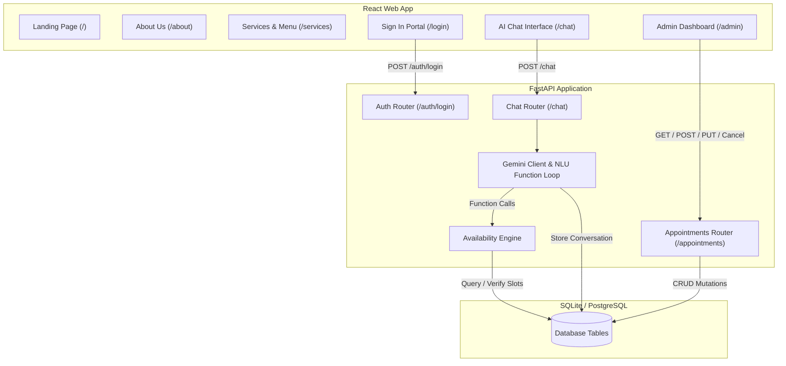

# BookBot — AI-Powered Appointment Booking Assistant

BookBot is an intelligent, conversational booking assistant designed for a local barbershop or salon. It allows customers to browse services, check availability, book appointments, reschedule, and cancel bookings via natural language, while providing a secure web dashboard for administrators to manage appointments.

---

## 1. Abstract

Booking an appointment with a small business today usually means endless back-and-forth texting — *"Are you free on Tuesday?"*, *"Can we shift it to Wednesday?"* — until someone finally locks in a slot. It is slow, prone to miscommunication, and leaves business owners juggling requests across WhatsApp, calls, and DMs with no single source of truth.

**BookBot** solves this with an AI-driven, conversational booking assistant paired with a centralized management portal:

- **For Customers**: Anyone can request a booking in everyday language — *"Book me a haircut this Friday afternoon"* — and the assistant identifies missing details, checks live availability, and confirms the reservation. No rigid multi-step forms, no dropdown menus, and no calendar friction.
- **For Business Owners**: A real-time admin dashboard aggregates every booking with instant filtering, manual scheduling, and one-click cancellation or status updates.
- **The Core Reliability Constraint**: Availability checking is bulletproof. Every booking, edit, and rescheduling action runs through strict deterministic conflict validation before confirmation, preventing double-bookings and maintaining absolute calendar trust.

The thesis is simple: **natural language removes the friction of booking, and a central dashboard removes the chaos of scattered inboxes.**

---

## 2. Spec & Plan

### High-Level Architecture

The system is built on a decoupled full-stack architecture separating conversational interfaces from admin management dashboard tools.



### Feature Breakdown
1. **Interactive Conversational Booking**: A responsive multi-turn chat widget allowing customers to request bookings, query availability, reschedule, and cancel appointments using everyday English.
2. **Deterministic Availability Engine**: A backend component validating all booking slots to prevent conflicts, enforce operational business hours, block past times, and align slots to 15-minute intervals.
3. **Admin Dashboard CRUD**: A secure dashboard running on React Router with filters for status (confirmed, cancelled, completed), date selection, and modal-based CRUD (Create, Read, Update, Delete) forms.
4. **JWT-Based Authentication**: Secure admin routes requiring login, storing bearer tokens, and protecting data mutation endpoints.
5. **System Prompt Date Injection**: Injects the local weekday and date into Gemini's context on every invocation, permitting exact natural language relative date resolution (e.g. "tomorrow", "next Friday").

### Gemini 2.5/3.5 Function Calling Tools
The assistant is equipped with 6 structural function-calling tools:
1. `create_appointment(customer_name, customer_contact, service_id, start_time)`: Prepares a booking with user details and datetime slots (returns details to prompt for confirmation).
2. `find_availability(service_id, date)`: Searches open 15-minute boundary slots for a given service and day.
3. `reschedule_appointment(appointment_id, new_start_time)`: Updates an existing appointment to a new date and time.
4. `cancel_appointment(appointment_id)`: Cancels a confirmed booking.
5. `get_appointment_status(appointment_id)`: Retrieves status (e.g. confirmed/cancelled) and booking information.
6. `ask_clarification(question)`: Asks customer questions to resolve ambiguous inputs.

### Relational Database Schema
The database contains 4 primary tables:
```sql
CREATE TABLE services (
    id INTEGER PRIMARY KEY AUTOINCREMENT,
    name VARCHAR(100) NOT NULL UNIQUE,
    duration_minutes INTEGER NOT NULL
);

CREATE TABLE appointments (
    id INTEGER PRIMARY KEY AUTOINCREMENT,
    customer_name VARCHAR(200) NOT NULL,
    customer_contact VARCHAR(200) NOT NULL,
    service_id INTEGER NOT NULL,
    start_time DATETIME NOT NULL,
    end_time DATETIME NOT NULL,
    status VARCHAR(20) NOT NULL DEFAULT 'confirmed', -- confirmed, cancelled, completed
    created_via VARCHAR(10) NOT NULL DEFAULT 'admin', -- chat, admin
    created_at DATETIME DEFAULT CURRENT_TIMESTAMP,
    FOREIGN KEY (service_id) REFERENCES services(id)
);

CREATE TABLE admin_users (
    id INTEGER PRIMARY KEY AUTOINCREMENT,
    email VARCHAR(200) NOT NULL UNIQUE,
    password_hash VARCHAR(255) NOT NULL
);

CREATE TABLE chat_messages (
    id INTEGER PRIMARY KEY AUTOINCREMENT,
    session_id VARCHAR(100) NOT NULL,
    role VARCHAR(20) NOT NULL, -- user, assistant
    content TEXT NOT NULL,
    created_at DATETIME DEFAULT CURRENT_TIMESTAMP
);
```

---

## 3. Implementation Details

### Stack and Models Used
- **Frontend**: React (v18.3), React Router (v6.28), and Vite (v6.0). Responsive layouts styled via Vanilla CSS custom properties.
- **Backend**: FastAPI (v0.115) web framework, SQLAlchemy ORM, and SQLite database for local dev (built to migrate to PostgreSQL easily).
- **AI/NLU Core**: Google GenAI SDK using `gemini-2.5-flash` for conversational processing.
  - *Why*: Offers sub-second latency, robust multi-turn instruction-following, and highly reliable native function-calling schemas.
- **Code Optimization**: Assisted by `gemini-3.5-flash` (Antigravity Agent) for code auditing, writing integration tests, and fixing timezone logic.

### Dynamic Date Resolution
Since cloud servers operate on UTC, relative NLU queries like *"tomorrow"* or *"next Monday"* fail if the model does not have a local reference time. 
To resolve this, the backend dynamically builds the system prompt for Gemini on every message by:
1. Retrieving the business's current local date, time, and day of the week using the timezone setting (`Asia/Kolkata` by default).
2. Injecting this local timestamp at the top of the prompt instruction.
3. This allows the model to map "tomorrow" to the exact `YYYY-MM-DD` string, which is then passed to `find_availability` or `create_appointment`.

### Timezone Handling
- Naive datetimes are stored in the SQLite/PostgreSQL database representing the business's local clock time.
- The backend utilizes a `get_business_now()` helper to resolve current local wall-clock times dynamically, preventing timezone discrepancies from causing false past-time bookings or scheduling misalignments.

### Token Estimation
- **Input Tokens per Turn**: ~800 tokens
  - Context includes the system instruction prompt (~300 tokens), formatted live services list (~150 tokens), chat history (increases by ~100-200 tokens per turn), and function call results.
- **Output Tokens per Turn**: ~80-150 tokens
  - Gemini outputs either a direct structured function call (minimal tokens) or a concise user response.
- **Total Session (5-turn conversation)**: ~5,000 input tokens, ~600 output tokens.

---

## 4. Edge Cases Handled

The application is hardened against several critical edge cases to ensure data integrity and scheduling reliability:

1. **Database-Wide Overlap Booking (Single Provider Constraint)**:
   - *Problem*: The barbershop/salon acts as a single provider. Booking a *Haircut* at 10:00 AM should prevent a *Massage* from being booked at 10:15 AM.
   - *Solution*: The backend availability engine checks overlap across **all** service IDs in the database. An existing confirmed slot blocks any other appointment from starting within its range.
2. **Out of Business Hours**:
   - *Problem*: Clients trying to book slots that start before opening hours (9:00 AM) or end after closing hours (5:00 PM).
   - *Solution*: The availability engine checks boundaries (`start_time < biz_start` and `end_time > biz_end`) and returns a clean `400 Bad Request` validation message.
3. **Past-Time Bookings**:
   - *Problem*: Booking a slot that has already occurred (e.g. booking for 10:00 AM when the local time is 11:30 AM).
   - *Solution*: Compare booking datetimes against `get_business_now()` and reject past bookings with a `400 Bad Request`.
4. **Natural Language Date Ambiguities**:
   - *Problem*: Relative text queries like "next Wednesday" causing incorrect date resolution.
   - *Solution*: Handled in the regex-based and fuzzy `parse_date` utility inside [`backend/services/date_utils.py`](file:///Users/bhavishyakatariya/bookbot/backend/services/date_utils.py) and supported by dynamic prompt date injection.
5. **Race Condition Guard**:
   - *Problem*: Two users viewing the same open slot and confirming it at the same moment.
   - *Solution*: When a user replies "yes" to confirm a pending booking, the backend runs the availability overlap check a **second time** immediately before writing to the database.
6. **Frontend State Persistence**:
   - *Problem*: The user completes a booking, but the "Pending Action" banner remains stuck on the screen.
   - *Solution*: The React state `pendingAction` is set to `null` if the response `pending_action` field returns `null` or is empty.
7. **Robust HTTP Status Mapping**:
   - *Problem*: API validation issues returning generic 500 errors.
   - *Solution*: The backend returns `400 Bad Request` for bad parameters (past dates, closed business days), `409 Conflict` for overlaps, and `401 Unauthorized`/`403 Forbidden` for credential issues.
